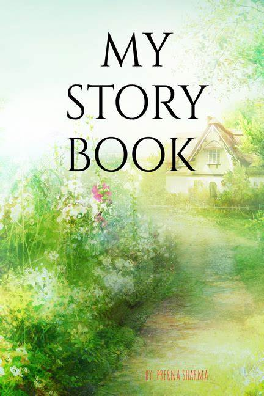

# Storyline Central

Storyline Central is a web-based platform that shares inspiring stories from around the world. Users can **read, listen, comment, and share** stories easily.

## Features
- Dynamic display of stories with titles, full content, and summaries.
- **Read** summaries with a toggle button.
- **Listen** to stories using built-in text-to-speech.
- Search functionality to quickly find stories.
- Share stories on **Facebook** and **Twitter**.
- Download stories as `.txt` files.
- Comment system with add/delete functionality.

## Technologies Used
- HTML, CSS, JavaScript
- Browser Text-to-Speech API

## Usage
1. Open `index.html` in a browser.
2. Use the navigation to explore Home, About, and Contact sections.
3. Click **READ** to see story summaries.
4. Click **LISTEN** to hear the story.
5. Share, download, or comment on your favorite stories.

## Notes
- Make sure the `images/` folder contains the required images for proper display.
- For audio playback, local audio files need correct paths or should be hosted for online use.

